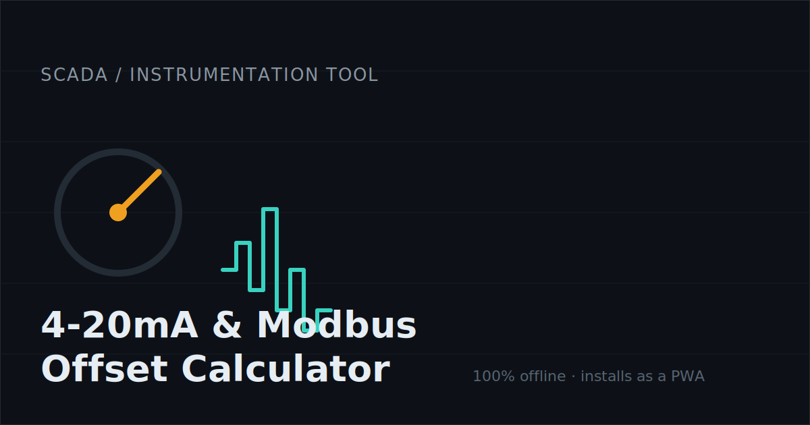
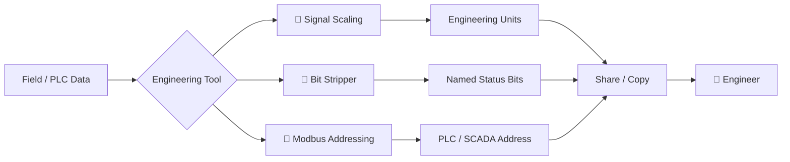
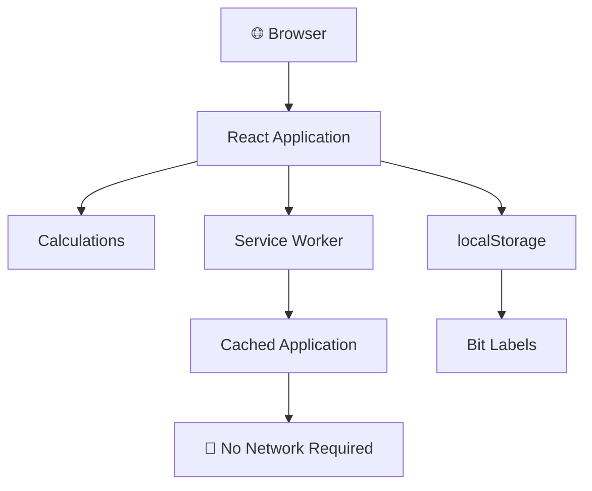

<div align="center">

# ⚡ 4–20 mA Signal & Modbus Offset Calculator

### Engineering utilities for SCADA · PLC · Instrumentation · Modbus

**Calculate. Decode. Convert. Share. Work offline.**

[](https://web.dev/explore/progressive-web-apps)
[](#offline--privacy)
[](https://react.dev/)
[](https://vitejs.dev/)
[](#license)

<br>

<a href="https://github.com/your-user/signal-modbus-calc">
  
</a>

<br>

**A small toolbox for the numbers that show up on PLC screens, instrument datasheets,
control panels, commissioning sheets, and Modbus maps.**

</div>

---

## 🧭 What does it do?

This app brings three common instrumentation tasks into one fast, installable tool:

| Tool                     | Purpose                                                |
| ------------------------ | ------------------------------------------------------ |
| 📐 **Signal Scaling**    | Convert electrical signals into engineering units      |
| 🧩 **Bit Stripper**      | Decode a 16-bit PLC integer bit-by-bit                 |
| 🔌 **Modbus Addressing** | Convert wire offsets ↔ human-facing register addresses |

No backend.
No account.
No telemetry.
No cloud calculation.

> [!TIP]
> Install it as a PWA and keep it available on a laptop, tablet, phone, or engineering workstation—even when you're standing in front of a cabinet with no network connection.

---

## 📐 Signal Scaling

Convert common analog signals into engineering values — and back again.

```text
     FIELD SIGNAL                         ENGINEERING VALUE

       4–20 mA
           │
           │
           ▼
     ┌───────────┐
     │  Scaling  │
     │  Engine   │
     └─────┬─────┘
           │
           ▼
     0 ───────────── 100 °C
           │
           │
           ▼
      Process Value
```

Supported input ranges:

* `4–20 mA`
* `0–20 mA`
* `1–5 V`
* `0–10 V`
* Raw ADC counts
* Custom input/output spans

### Example

```text
4 mA   ──────────────── 0 %
12 mA  ──────────────── 50 %
20 mA  ──────────────── 100 %
```

The calculator works **bidirectionally**, so you can calculate:

```text
raw signal → engineering value
engineering value → required signal
```

It also validates the configured span and provides an out-of-range indication when appropriate.

---

## 🧩 16-Bit Bit Stripper

Paste a PLC integer and immediately see its individual bits.

Supports:

```text
Decimal    12345
Hex        0x3039
Binary     0b0011000000111001
```

Output:

```text
15  14  13  12  11  10  09  08  07  06  05  04  03  02  01  00
 │   │   │   │   │   │   │   │   │   │   │   │   │   │   │   │
 0   0   1   1   0   0   0   0   0   0   1   1   1   0   0   1
```

### Persistent bit labels

Give bits your own engineering names:

```text
Bit 15  →  Pump Fault
Bit 14  →  High Level
Bit 13  →  Low Level
Bit 12  →  Remote Mode
...
Bit 00  →  Running
```

Labels are stored locally in `localStorage`.

> [!NOTE]
> Your labels never leave the device.

---

## 🔌 Modbus Addressing

Stop mentally converting between wire offsets and the addresses shown in PLC documentation.

```text
┌─────────────────────────────────────────────┐
│             Modbus Addressing               │
├─────────────────────────────────────────────┤
│                                             │
│  Wire offset          Human address        │
│                                             │
│      0       ───────►     40001             │
│      1       ───────►     40002             │
│      2       ───────►     40003             │
│      ...                 ...                │
│                                             │
└─────────────────────────────────────────────┘
```

Supported address families:

| Type              | Typical notation | Base |
| ----------------- | ---------------: | ---: |
| Coils             |          `00001` |    1 |
| Discrete inputs   |          `10001` |    1 |
| Input registers   |          `30001` |    1 |
| Holding registers |          `40001` |    1 |

Convert in either direction:

```text
zero-based offset
        ⇅
1-based / 40001-style address
```

---

## 🧠 How the app fits together



Everything happens locally in the browser.

---

## ✨ Features at a glance

<table>
<tr>
<td width="33%" align="center">

### 📐

### Signal Scaling

4–20 mA
0–20 mA
1–5 V
0–10 V
ADC counts

</td>
<td width="33%" align="center">

### 🧩

### Bit Decoding

Decimal
Hex
Binary
16-bit visualization
Persistent labels

</td>
<td width="33%" align="center">

### 🔌

### Modbus

Offsets
40001 registers
30001 registers
Coils
Discrete inputs

</td>
</tr>

<tr>
<td align="center">

### 📱

### PWA

Installable
Responsive
Home-screen ready
Kiosk friendly

</td>
<td align="center">

### 📴

### Offline

No backend
No account
No telemetry
Works without internet

</td>
<td align="center">

### ↗️

### Sharing

Web Share API
Clipboard fallback
Messenger
WhatsApp
Slack

</td>
</tr>
</table>

---

## 🖥️ Interface

Add screenshots to `docs/screenshots/` and keep light/dark variants:

<picture>
  <source media="(prefers-color-scheme: dark)" srcset="./docs/screenshots/app-dark.png">
  <source media="(prefers-color-scheme: light)" srcset="./docs/screenshots/app-light.png">
  
</picture>

> [!TIP]
> GitHub supports responsive `<picture>` blocks, so the README can show different artwork depending on the reader's light/dark theme.

---

## 🛠️ Tech stack

| Layer       | Technology                              |
| ----------- | --------------------------------------- |
| UI          | React 18                                |
| Build       | Vite                                    |
| Styling     | Tailwind CSS                            |
| Icons       | Lucide React                            |
| PWA         | Web App Manifest + Service Worker       |
| Persistence | `localStorage`                          |
| Hosting     | GitHub Pages / Render / any static host |

### Design language

The UI is intentionally aimed at engineering software rather than a generic consumer dashboard:

```text
Typography
├── UI          → IBM Plex Sans / system sans
└── Values      → JetBrains Mono / system monospace

Visual language
├── Dark-mode first
├── High information density
├── Strong numeric alignment
├── Technical status indicators
├── Lucide line icons
└── Minimal decorative UI
```

For a completely offline build, bundle the fonts locally rather than loading Google Fonts at runtime.

---

## 🚀 Quick start

```bash
git clone https://github.com/your-user/signal-modbus-calc.git
cd signal-modbus-calc

npm install
npm run dev
```

Open the local URL printed by Vite.

### Production build

```bash
npm run build
npm run preview
```

---

## 📦 Deployment

### GitHub Pages

The repository includes a GitHub Actions deployment workflow.

1. Push the repository to GitHub.
2. Open **Settings → Pages**.
3. Select **GitHub Actions** as the source.
4. Set the Vite `base` path to your repository name.
5. Keep `manifest.json` `start_url` and `scope` aligned with the deployment path.
6. Push to `main`.

```text
push main
   │
   ▼
GitHub Actions
   │
   ├── npm install
   ├── npm run build
   │
   ▼
dist/
   │
   ▼
GitHub Pages
```

### Render / static hosting

```text
Build command:     npm run build
Publish directory: dist
```

For root-domain hosting:

```js
base: '/'
```

and:

```json
{
  "start_url": "/",
  "scope": "/"
}
```

---

## 📴 Offline & privacy

The application is designed around an **offline-first architecture**.



### No backend

The core application does not require:

* API calls
* Database access
* User accounts
* Cloud computation
* Analytics

### Local data

Bit-stripper labels are stored locally on the device using `localStorage`.

### Fonts

If `index.html` loads Google Fonts, that is the one optional third-party request in the current implementation.

For a **truly self-contained offline build**, download and bundle the fonts with the application.

---

## 📁 Project structure

```text
signal-modbus-calc/
│
├── .github/
│   └── workflows/
│       └── deploy.yml
│
├── public/
│   ├── manifest.json
│   ├── sw.js
│   ├── robots.txt
│   │
│   ├── icon.svg
│   ├── icon-192.png
│   ├── icon-512.png
│   ├── icon-maskable-512.png
│   │
│   ├── og-image.svg
│   └── og-image.png
│
├── src/
│   ├── main.jsx
│   ├── App.jsx
│   ├── index.css
│   │
│   └── components/
│       ├── ScalingCalculator.jsx
│       ├── BitStripper.jsx
│       ├── ModbusAddressing.jsx
│       └── ShareButton.jsx
│
├── index.html
├── tailwind.config.js
├── postcss.config.js
├── vite.config.js
└── package.json
```

---

## 🔐 Engineering-friendly by design

The application deliberately avoids unnecessary infrastructure.

```text
                    ┌──────────────────┐
                    │     Engineer     │
                    └────────┬─────────┘
                             │
                             ▼
                    ┌──────────────────┐
                    │  Browser / PWA   │
                    └────────┬─────────┘
                             │
             ┌───────────────┼───────────────┐
             ▼               ▼               ▼
        Signal Math      Bit Decode      Modbus Math
             │               │               │
             └───────────────┼───────────────┘
                             ▼
                    ┌──────────────────┐
                    │ Local UI / State │
                    └──────────────────┘

              No server ── No account ── No database
```

---

## 🧪 Engineering examples

### 4–20 mA transmitter

```text
Transmitter range:
0 ───────────────────────── 100 °C

Signal:
4 mA                         20 mA
 │                             │
 ▼                             ▼
0 °C ──────────────── 50 °C ─── 100 °C
```

### PLC status word

```text
Raw value:
0xA135

Binary:
1010 0001 0011 0101

Bits:
15 14 13 12 | 11 10 09 08 | 07 06 05 04 | 03 02 01 00
 1  0  1  0 |  0  0  0  1 |  0  0  1  1 |  0  1  0  1
```

### Modbus register

```text
Wire offset:      24
Holding register: 40025
```

---

## 🌐 Before publishing

Replace the placeholder URLs:

```text
https://example.com/signal-modbus-calc/
```

in:

* `index.html`
* `public/manifest.json`
* canonical URL
* Open Graph metadata
* Twitter Card metadata
* JSON-LD

Also update:

```text
public/og-image.png
```

if you customize the social preview.

GitHub supports repository-level social preview images; for best rendering, GitHub currently recommends an image around **1280 × 640 px** and under **1 MB**.

---

## 🖼️ Recommended asset set

I would add these assets to make the repository feel like a polished engineering product:

```text
docs/
└── screenshots/
    ├── app-light.png
    ├── app-dark.png
    ├── scaling.png
    ├── bit-stripper.png
    └── modbus.png

public/
├── icon.svg
├── icon-192.png
├── icon-512.png
├── icon-maskable-512.png
├── og-image.svg
└── og-image.png
```

### Icon direction

Use a single visual language:

```text
⚡ Signal
│
├── 4–20 mA waveform
├── small terminal / instrumentation symbol
└── digital conversion motif

🧩 Bits
│
├── 16 segmented cells
└── binary / PLC visual language

🔌 Modbus
│
├── register grid
└── RX/TX or industrial bus motif
```

Lucide is a good fit because the line-icon style matches the technical UI without making the README look like a consumer SaaS product.

---

## 🤝 Contributing

Pull requests and improvements are welcome.

For substantial changes, please open an issue first so the implementation can be discussed before development begins.

---

## 📄 License

MIT — use it, fork it, modify it, and put your company's logo on it.

---

<div align="center">

### Built for the people who still have to read the PLC register map.

**SCADA · PLC · Modbus · Instrumentation · Commissioning**

</div>
